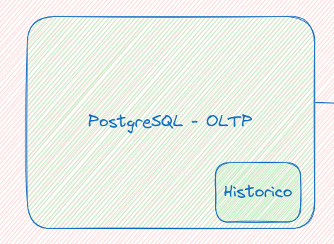
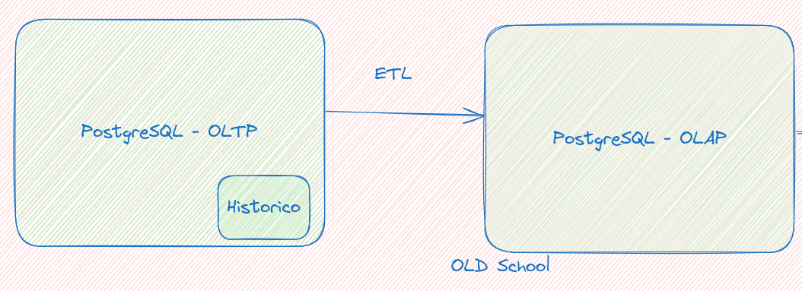
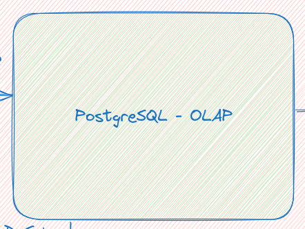

# Jornada Engenharia de dados


Bem-vindo ao Mapa do Engenheiro de Dados, um programa prático e desafiador que recria situações reais enfrentadas por profissionais da área de dados. Neste módulo, você será guiado na construção de uma arquitetura robusta e paralela, que simula um ambiente dinâmico e ininterrupto, tal como ocorre no mercado.

Ao longo do curso, você aprenderá os fundamentos e aplicará técnicas avançadas de modelagem de dados, desenvolvendo consultas transacionais e analíticas em SQL, alcançando um nível de maestria.

# Liga Sudoers - Dados Transacionais e Dados Dimensionais

Este repositório visa mostrar o processo trandicional de geração de dados em ambiente transacionais e ETL para ambiente analiticos. Ao subir os containeres serão:
  * 1 ambiente PostgreSQL com modelagem transacional, usando 3 forma normal (3FN)
  * 1 ambiente PostgreSQL com modelagem dimensional. usando star schema. 
  * 1 ambiente com Apache Hop para processos de ETL entre os servidores PostgreSQL. 
  * 1 ambiente com Metabase para construção de dashboards que serão usados para analytics. 
  
  Dentro do repositório teremos os scripts em Python que irão simular a entrada de dados:
  * liga_sudoers_historico.py - Gera dados históricos com pedidos com data retroativas, não gera novos produtos nem novos clientes. Gera 1% de dados que serão considerados fraude para treinamento do modelo. 
  * liga_sudoers_streaming.py - Gera dados streamind com pedidos com data atual, gera novos clientes e registra novos pedidos. Gera 5% de dados que serão considerados fraude para treinamento do modelo. 

  [Vídeo Explicativo](https://youtu.be/Kc-mmy8eMcA)

  [Aula 01](https://www.youtube.com/watch?v=Y6LnIujlbhc&list=PLD3-a_5KsN3nuXukrq8kCYtxnZR4FD2nJ&index=10)


## Estrutura da Fraude

A fraude é usada para treinar o modelo de Machine Learning que será usado para identificar fraudes em tempo real. O ambiente dimensional (DataWarehouse) extrai os dados via ETL (Apache Hop) e popula as informações em outro database para ser usado como ambiente analitico. Esse é um processo tradicional de manipulação de dados.

A fraude é encontrada no geohash (Lat/Lon) da pessoa que fez o pedido. Será considerado fraude qualquer posição geohash fora dos estados de SP, MG e RJ. Ou seja, caso a compra seja de uma posição fora dos estados, deverá ser marcada como fraude. 

A fraude é encontrar no dispositivo da pessoa que fez o pedido. Será considerado fraude qualquer pedido que tenha um dispositivo diferente dos anteriores na hora da compra. Ou seja, se a pessoas comprou anteriormente com Iphone, e agora tentou comprar com um Samsung o pedido será marcado como fraude. 

## Estrutura do Projeto
```bash
├─modelagem
    ├── data_simulator
    │   ├── `functions.py`: Funções reutilizáveis para manipulação de banco de dados e geração de dados.
    │   ├── __init__.py
    │   ├── `liga_sudoers_historico.py`: Gera dados históricos e os insere no banco de dados.
    │   └── `liga_sudoers_streaming.py`: Gera dados para simulação de streaming de forma contínua.
    ├── datawarehouse_simulator
        ├── `datawarehouse_extern.sql`: Gera fluxos para criação do ETL externo
        ├── `datawarehouse_local.sql`: Gera fluxos para criação do ETL interno        
    ├───├── ddl
    │   ├── `liga_sudoers_dw.sql`: Script SQL para criação do banco de dados e tabelas do dimensional.
    │   ├── `liga_sudoers.sql`: Script SQL para criação do banco de dados e tabelas do transacional.
    │   └── `modelagem.txt`: Diagrama Entidade Relacionamento que foi desenvolvido usando o [dbdiagram.io](https://dbdiagram.io/)
    ├── docker-compose.yml: Imagens somente com o PostgreSQL
    ├── etl_sudoers
    │   ├── `move_pedidos.hpl`: Pipeline para ETL da tabelas pedidos
    │   ├── `move_pessoas.hpl`: Pipeline para ETL da tabelas pessoas
    │   ├── `move_produtos.hpl`: Pipeline para ETL da tabelas produtos
    │   ├── `postgres_liga_sudoers_dw.json`: Conexão para banco PostgreSQL DataWahouse (OLAP)
    │   └── `postgres_liga_sudoers.json`: Conexão para banco PostgreSQL Transacional (OLTP)
    ├── liga_sudoers
    │   └── .....: Vários arquivos que serão usados para subir as imagens
    ├── liga_sudoers_dw
    │   └── .....: Vários arquivos que serão usados para subir as imagens
    ├── metabase_db
    │   └── .....: Vários arquivos que serão usados para subir as imagens
    └── README.md: Detalhes de como executar as etapas 
├── docker-compose.yml: Imagens para todo o processo do OLD_SCHOOL    
├── README.md
├── Desafio - Jornada Engenheiro de Dados: Imagem da jornada do engenheiro de dados
└── Virada-AWS.excalidraw
```
## Perfil e responsabilidades

Perfis de profissionais e suas responsabilidades no dia a dia dos processos mostrados.
 - Database Administrator (DBA)
 - Data Warehouse Specialist ou Data Engineer
 - Data Analyst ou Business Intelligence (BI) Analyst

### Database Administrator (DBA) ou Data Architect
Modelagem de Banco de Dados Transacional

    Profissional: Database Administrator (DBA)
        Responsabilidades:
            Planejar e implementar a estrutura de bancos de dados relacionais.
            Garantir normalização, integridade referencial e alta performance em operações transacionais.
            Criar índices, restrições, triggers e stored procedures para otimizar operações.
            Monitorar e otimizar o desempenho do banco. 

### Data Warehouse Specialist
Modelagem Dimensional

    Profissional: Data Warehouse Specialist ou Data Engineer
        Responsabilidades:
            Projetar esquemas dimensionais como Star Schema e Snowflake Schema.
            Criar tabelas de fato e dimensão para facilitar consultas analíticas.
            Trabalhar com conceitos como surrogate keys, granularidade e hierarquias.
            Garantir que os modelos atendam às necessidades de relatórios e análises.
            Desenvolver processos de ETL/ELT para extrair, transformar e carregar dados em Data Warehouses.
            Automação e orquestração de fluxos de dados usando ferramentas como Apache Hop, Talend ou Pentaho.
            Integrar dados de múltiplas fontes e garantir qualidade e consistência.
            Monitorar e corrigir falhas nos pipelines para garantir alta disponibilidade.

### Data Analyst ou Business Intelligence (BI) Analyst
Criação de Dashboards

    Profissional: Data Analyst ou Business Intelligence (BI) Analyst
        Responsabilidades:
            Criar visualizações e relatórios interativos para tomada de decisão.
            Utilizar ferramentas de BI como Power BI, Tableau, Looker ou Metabase.
            Definir métricas e KPIs com base nos requisitos de negócios.
            Trabalhar diretamente com as partes interessadas para transformar dados em insights acionáveis.

## Pré-requisitos

- Python 3.x
- Docker e Docker Compose
- Biblioteca `psycopg2`
- Biblioteca `Faker`

### Instalação das dependências:
```bash
pip install psycopg2 faker
```

## Antes de Executar

### Dar permissão de execução
```bash
chmod +x modelagem/liga_sudoers/*.sh modelagem/liga_sudoers_dw/*.sh
```

### Instalação do Docker Compose
```bash
sudo apt update
sudo apt install docker-compose-plugin
```

### Verificação da Versão (opcional)
```bash
docker compose version
```

### Parar o PostgreSQL se estiver usando na máquina local (opcional)
```bash
sudo systemctl stop postgresql
```


## Como Executar

### Iniciar Docker pela primeira vez (somente a primeira vez que rodar o processo)
```bash
docker compose up --build
```

### Iniciar Docker pela segunda vez
```bash
docker compose up 
```


### Validar se as bases de dados foram criadas corretamente
```bash
docker exec -it postgres_liga_sudoers psql -U sudoers -d liga_sudoers -c "\dt"
docker exec -it postgres_liga_sudoers_dw psql -U sudoers -d liga_sudoers_dw -c "\dt"
```

### Parar o Docker Compose caso esteja rodando
```bash
docker compose stop
```

## Rodando inserção dos dados

### Inserção de dados Históricos
```bash
#python3 data_simulator/liga_sudoers_historico.py <qtde_registros> 
python3 data_simulator/liga_sudoers_historico.py 100
```

`<qtde_registros>` é 10 por padrão, que é pouco, tente usar algo em torno de 1000 para gerar uma massa grande de dados. 1000 registros podem demorar até 5 minutos para gerar todos os dados. E na execução do ETL pode demorar mais tempo ainda devido a movimentação inicial do histórico, então use esse valor com sabedoria. 

### Inserção de dados Streaming (opcional)
```bash
python3 data_simulator/liga_sudoers_streaming.py 1
```

Esse python roda infinitamente, caso queira finalizá-lo será necessário executar o comando CTRL+C

## Modelagem Dimensional Local
```bash
docker exec -it postgres_liga_sudoers bash 
psql -U sudoers -d liga_sudoers -h postgres_liga_sudoers
```

Acesso o arquivo `modelagem/datawarehouse_simulator/datawarehouse_local.sql` e execute os comandos do arquivo dentro do banco OLTP.  

## Modelagem Dimensional Externa
Vamos agora para o banco OLAP para simular o ETL e a movimentação de dados. 

### Apagamos manualmente a tabela stg_pessoas
```bash
docker exec -it postgres_liga_sudoers_dw psql -U sudoers -d liga_sudoers_dw -c "TRUNCATE stg_pessoas; TRUNCATE stg_pedidos; TRUNCATE stg_produtos;"
```

### Vamos logar na máquina origem, com a modelagem transacional
```bash
docker exec -it postgres_liga_sudoers bash
```

Logado na máquina vamos fazer o dump (E) da tabela Pessoa



```bash
pg_dump -a -U sudoers -d liga_sudoers --table=pessoas > /tmp/pessoas.sql
```

Verifique que o arquivo /tmp/pessoas.sql possui o nome da tabela pessoas, porém essa tabela não existe na origem. Com isso precisaremos fazer uma leve transformação (T) . 

Fazemos a transformação básica para transmitir o arquivo para o destino



```bash
cat /tmp/pessoas.sql | sed s'/pessoas/stg_pessoas/g'  > /tmp/pessoas_transform.sql
```


Enviei o arquivo para o servidor de destino, o servidor de DW irá armazenar a informação enviada na tabela de Staging. Com isso faremos o carregamento do arquivo (L).




```bash
psql -U sudoers -d liga_sudoers_dw -h postgres_liga_sudoers_dw < /tmp/pessoas_transform.sql
```
- password : `password`


### Para produtos e pedidos preciso fazer um ETL um pouco diferente
É importante que já tenha populado a base com informações iniciais. 

```bash
psql -U sudoers -d liga_sudoers -h postgres_liga_sudoers -c 'COPY 
(SELECT p.id, c.descricao, p.descricao, p.created_at, p.updated_at 
    FROM produtos p INNER JOIN categorias c ON c.id = p.id_categoria) 
TO STDOUT WITH (FORMAT text);' > /tmp/produtos.sql
```
```bash
psql -U sudoers -d liga_sudoers -h postgres_liga_sudoers -c 'COPY 
(SELECT p.id AS id_pedido, p.id_pessoa, i.id_produto, a.dispositivo, a.geohash, a.telefone, p.dt_venda, i.qtde, i.valor_total AS valor_unit, p.valor_total 
        FROM pedidos p 
            INNER JOIN itens_pedidos i 
            ON p.id = i.id_pedido 
            INNER JOIN auditoria_pedidos a 
            ON p.id = a.id_pedido) 
    TO STDOUT WITH (FORMAT text);' > /tmp/pedidos.sql
```


### Importa tabela
```bash
psql -U sudoers -d liga_sudoers_dw -h postgres_liga_sudoers_dw -c "COPY stg_produtos FROM STDIN;" < /tmp/produtos.sql
```

```bash
psql -U sudoers -d liga_sudoers_dw -h postgres_liga_sudoers_dw -c "COPY stg_pedidos FROM STDIN;" < /tmp/pedidos.sql
```

```bash
psql -U sudoers -d liga_sudoers_dw -h postgres_liga_sudoers_dw -c "INSERT INTO dim_pessoas (id, nome, sexo, dt_nasc, created_at, updated_at)
    SELECT id, nome, sexo, dt_nasc, created_at, updated_at
    FROM stg_pessoas pessoas
    WHERE NOT EXISTS (
        SELECT 1
        FROM dim_pessoas dp
        WHERE pessoas.id = dp.id
        AND pessoas.nome = dp.nome
        AND pessoas.sexo = dp.sexo
        AND pessoas.dt_nasc = dp.dt_nasc
        AND pessoas.created_at = dp.created_at
        AND pessoas.updated_at = dp.updated_at
    );"
```


```bash
psql -U sudoers -d liga_sudoers_dw -h postgres_liga_sudoers_dw -c "INSERT INTO dim_produtos(id, cat_desc, descricao, created_at, updated_at) 
    SELECT p.id, p.cat_desc, p.descricao, p.created_at, p.updated_at 
    FROM stg_produtos p         
    WHERE NOT EXISTS (
        SELECT 1
        FROM dim_produtos dp
        WHERE p.id = dp.id
        AND p.cat_desc = dp.cat_desc
        AND p.descricao = dp.descricao
        AND p.created_at = dp.created_at
        AND p.updated_at = dp.updated_at
);"
```

```bash
psql -U sudoers -d liga_sudoers_dw -h postgres_liga_sudoers_dw -c "INSERT INTO fato_pedidos(id_pedido, sk_pessoa, sk_produto, dispositivo, geohash, telefone, dt_venda, qtde, valor_unit, total) 
    SELECT s.id_pedido, sk_pessoa, sk_produto, dispositivo, geohash, telefone, dt_venda, qtde, valor_unit, valor_total 
        FROM stg_pedidos s 
            INNER JOIN dim_pessoas dp 
                ON dp.id = s.id_pessoa 
            INNER JOIN dim_produtos pr 
                ON pr.id = s.id_produto
WHERE NOT EXISTS (
    SELECT 1
    FROM fato_pedidos
    WHERE fato_pedidos.id_pedido = s.id_pedido
      AND fato_pedidos.sk_pessoa = dp.sk_pessoa
      AND fato_pedidos.sk_produto = pr.sk_produto
      AND fato_pedidos.dt_venda = s.dt_venda
      AND fato_pedidos.total = s.valor_total
);"    
```

### Query validação modelagm transacional
```bash
psql -U sudoers -d liga_sudoers -h postgres_liga_sudoers -c "SELECT geohash, cat_desc, EXTRACT(MONTH FROM dt_venda) as mes, avg(COALESCE(valor_unit, 0 )) as media, sum(COALESCE(valor_unit, 0 )) as total
FROM ( -- VIEW
    SELECT c.descricao as cat_desc, *
    FROM pedidos p            
            INNER JOIN auditoria_pedidos a ON a.id_pedido = p.id
            INNER JOIN itens_pedidos ip 
                INNER JOIN produtos pr 
                    INNER JOIN categorias c ON c.id = pr.id_categoria
                ON pr.id = ip.id_produto
            ON ip.id_pedido = p.id                        
) fato_pedidos
GROUP BY 1, 2, 3, mes
ORDER BY 1, 3, 2, mes LIMIT 5;"
```

### Query validação modelagem dimensional
```bash
psql -U sudoers -d liga_sudoers_dw -h postgres_liga_sudoers_dw -c "SELECT geohash, cat_desc, EXTRACT(MONTH FROM dt_venda) as mes, avg(COALESCE(valor_unit, 0 )) as media, sum(COALESCE(valor_unit, 0 )) as total
FROM fato_pedidos fp
    INNER JOIN dim_produtos dpr ON dpr.sk_produto = fp.sk_produto
GROUP BY 1, 2, 3, mes
ORDER BY 1, 3, 2, mes LIMIT 5;"
```

## Rodar Apache Hop
### Rodar Apache Hop na interface UI

Abra o Apache HOP no Browser antes de mover os arquivos para o diretório de conexões. 
```bash
localhost:8080
ou 
127.0.0.1:8080
```
`user: cluster`
`password: cluster`


### Rodar o ETL na interface UI
Abra o arquivo move_pessoas, move_produtos ou move_pedidos dentro do `/files` e execute o pipeline. Os arquivos .hpl (pipelines) estão localizados no diretório `/files`. Executar o move_pedidos por último, e executar os processos pelo menos 2 vezes seguidas. 

### Rodar Apache Hop no terminal
```bash
docker exec -it etl_scripts bash
/usr/local/tomcat/webapps/ROOT/hop-run.sh -f /files/move_pessoas.hpl --project default --runconfig local
/usr/local/tomcat/webapps/ROOT/hop-run.sh -f /files/move_produtos.hpl --project default --runconfig local
/usr/local/tomcat/webapps/ROOT/hop-run.sh -f /files/move_pedidos.hpl --project default --runconfig local
# 2x 
/usr/local/tomcat/webapps/ROOT/hop-run.sh -f /files/move_pessoas_incremental.hpl --project default --runconfig local --parameters REFERENCE_DATE=2025-01-19
/usr/local/tomcat/webapps/ROOT/hop-run.sh -f /files/move_produtos_incremental.hpl --project default --runconfig local --parameters REFERENCE_DATE=2025-01-19
/usr/local/tomcat/webapps/ROOT/hop-run.sh -f /files/move_pedidos_incremental.hpl --project default --runconfig local --parameters REFERENCE_DATE=2025-01-19

/usr/local/tomcat/webapps/ROOT/hop-run.sh -f /files/move_pessoas_reprocessamento.hpl --project default --runconfig local --parameters REFERENCE_DATE=2025-01-10
/usr/local/tomcat/webapps/ROOT/hop-run.sh -f /files/move_produtos_reprocessamento.hpl --project default --runconfig local --parameters REFERENCE_DATE=2025-01-10
/usr/local/tomcat/webapps/ROOT/hop-run.sh -f /files/move_pedidos_reprocessamento.hpl --project default --runconfig local --parameters REFERENCE_DATE=2025-01-10
```

 Obs.: Por algum motivo, a imagem docker precisa que rode o HOP duas vezes para os dados serem escritos corretamente. (Rode o HOP pelo menos 2 vezes)


### Validar o ETL
```bash
docker exec -it postgres_liga_sudoers_dw psql -U sudoers -d liga_sudoers_dw -c "SELECT * FROM dim_pessoas LIMIT 5;"
docker exec -it postgres_liga_sudoers_dw psql -U sudoers -d liga_sudoers_dw -c "SELECT * FROM dim_produtos LIMIT 5;"
docker exec -it postgres_liga_sudoers_dw psql -U sudoers -d liga_sudoers_dw -c "SELECT * FROM fato_pedidos LIMIT 5;"
```

## Dashboards

### Criar database
```bash
localhost:3000
ou
127.0.0.1:3000
```
`user: contato@sudoers.com.br`
`senha: *liga01`


## Contribuição

Contribuições são bem-vindas! Sinta-se à vontade para abrir issues ou enviar pull requests.

## Licença

Este projeto está licenciado sob a Licença SUDOERS.

