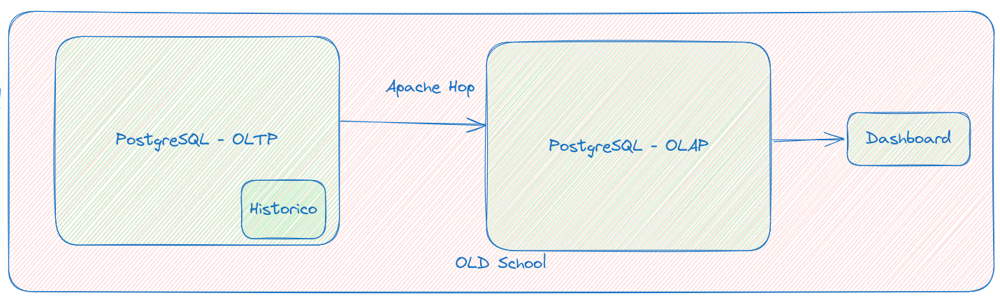

# Data Modeling


Bem-vindo ao Mapa do Engenheiro de Dados, módulo Data Modeling! Este programa prático e desafiador recria situações reais enfrentadas por profissionais da área de dados. Aqui, você aprenderá a construir modelos transacionais e dimensionais, além de desenvolver fluxos de ETL para movimentar dados entre esses dois mundos.

Ao final do curso, você terá domínio de conceitos avançados de modelagem de dados e SQL, sendo capaz de criar soluções que simulam o dia a dia de grandes arquiteturas de dados.

---

## Objetivos do Módulo

- Compreender a modelagem transacional (3FN) e dimensional (Star Schema).
- Desenvolver fluxos de ETL sem o uso de ferramentas automatizadas, utilizando SQL puro.
- Simular a movimentação de dados em ambientes de **Data Warehousing**.
- Criar consultas transacionais e analíticas com foco em performance e confiabilidade.

---

## Estrutura do Módulo

### Modelagem de Dados
1. **Transacional (3FN)**: Estruturas normalizadas para garantir integridade e evitar redundância de dados.
2. **Dimensional (Star Schema)**: Estruturas otimizadas para consultas analíticas, com tabelas de fato e dimensões.

### Simulação de Fluxos de Dados
- **ETL Manual**: Processos de extração, transformação e carga sem o uso de ferramentas ETL dedicadas.
- **Simulação de Entrada de Dados**: Geração de dados históricos e em streaming para preenchimento das bases.

---

## Como Executar

### Iniciar Docker pela primeira vez (somente a primeira vez que rodar o processo)
```bash
docker compose up --build
```

### Iniciar Docker pela segunda vez
```bash
docker compose up 
```


### Validar se as bases de dados foram criadas corretamente
```bash
docker exec -it postgres_liga_sudoers psql -U sudoers -d liga_sudoers -c "\dt"
docker exec -it postgres_liga_sudoers_dw psql -U sudoers -d liga_sudoers_dw -c "\dt"
```


# Simulando a entrada de dados no DW

## Vamos simular como seria o ETL sem o uso de nenhuma ferramenta


### Rodando inserção dos dados

```bash
#python3 data_simulator/liga_sudoers_historico.py <qtde_registros> 
python3 ../data_simulator/liga_sudoers_historico.py 100
```

`<qtde_registros>` é 10 por padrão, que é pouco, tente usar algo em torno de 1000 para gerar uma massa grande de dados. 1000 registros podem demorar até 5 minutos para gerar todos os dados. E na execução do ETL pode demorar mais tempo ainda devido a movimentação inicial do histórico, então use esse valor com sabedoria. 

### Apagamos manualmente a tabela stg_pessoas
```bash
docker exec -it postgres_liga_sudoers_dw_dm01 psql -U sudoers -d liga_sudoers_dw -c "TRUNCATE stg_pessoas; TRUNCATE stg_pedidos; TRUNCATE stg_produtos;"
```

### Vamos logar na máquina origem, com a modelagem transacional
```bash
docker exec -it postgres_liga_sudoers_dm01 bash
```

### Logado na máquina vamos fazer o dump de uma tabela


```bash
pg_dump -a -U sudoers -d liga_sudoers --table=pessoas > /tmp/pessoas.sql
```

### Verifique que o arquivo /tmp/produtos.sql possui o nome da tabela produtos, que não existe na origem. 
### Fazemos a transformação básica para transmitir o arquivo para o destino


```bash
cat /tmp/pessoas.sql | sed s'/pessoas/stg_pessoas/g'  > /tmp/pessoas_transform.sql
```


### Enviei o dump para o servidor de destino, o DW que irá armazenar a informação enviada na tabela de Staging


```bash
psql -U sudoers -d liga_sudoers_dw -h postgres_liga_sudoers_dw < /tmp/pessoas_transform.sql
```
- password : `password`


### Para produtos e pedidos preciso fazer um ETL um pouco diferente
É importante que já tenha populado a base com informações iniciais. 

```bash
psql -U sudoers -d liga_sudoers -h postgres_liga_sudoers -c 'COPY 
(SELECT p.id, c.descricao, p.descricao, p.created_at, p.updated_at 
    FROM produtos p INNER JOIN categorias c ON c.id = p.id_categoria) 
TO STDOUT WITH (FORMAT text);' > /tmp/produtos.sql
```
```bash
psql -U sudoers -d liga_sudoers -h postgres_liga_sudoers -c 'COPY 
(SELECT p.id AS id_pedido, p.id_pessoa, i.id_produto, a.dispositivo, a.geohash, a.telefone, p.dt_venda, i.qtde, i.valor_total AS valor_unit, p.valor_total 
        FROM pedidos p 
            INNER JOIN itens_pedidos i 
            ON p.id = i.id_pedido 
            INNER JOIN auditoria_pedidos a 
            ON p.id = a.id_pedido) 
    TO STDOUT WITH (FORMAT text);' > /tmp/pedidos.sql
```


### Importa tabela
```bash
psql -U sudoers -d liga_sudoers_dw -h postgres_liga_sudoers_dw -c "COPY stg_produtos FROM STDIN;" < /tmp/produtos.sql
```

```bash
psql -U sudoers -d liga_sudoers_dw -h postgres_liga_sudoers_dw -c "COPY stg_pedidos FROM STDIN;" < /tmp/pedidos.sql
```

```bash
psql -U sudoers -d liga_sudoers_dw -h postgres_liga_sudoers_dw -c "INSERT INTO dim_pessoas (id, nome, sexo, dt_nasc, created_at, updated_at)
    SELECT id, nome, sexo, dt_nasc, created_at, updated_at
    FROM stg_pessoas pessoas
    WHERE NOT EXISTS (
        SELECT 1
        FROM dim_pessoas dp
        WHERE pessoas.id = dp.id
        AND pessoas.nome = dp.nome
        AND pessoas.sexo = dp.sexo
        AND pessoas.dt_nasc = dp.dt_nasc
        AND pessoas.created_at = dp.created_at
        AND pessoas.updated_at = dp.updated_at
    );"
```


```bash
psql -U sudoers -d liga_sudoers_dw -h postgres_liga_sudoers_dw -c "INSERT INTO dim_produtos(id, cat_desc, descricao, created_at, updated_at) 
    SELECT p.id, p.cat_desc, p.descricao, p.created_at, p.updated_at 
    FROM stg_produtos p         
    WHERE NOT EXISTS (
        SELECT 1
        FROM dim_produtos dp
        WHERE p.id = dp.id
        AND p.cat_desc = dp.cat_desc
        AND p.descricao = dp.descricao
        AND p.created_at = dp.created_at
        AND p.updated_at = dp.updated_at
);"
```

```bash
psql -U sudoers -d liga_sudoers_dw -h postgres_liga_sudoers_dw -c "INSERT INTO fato_pedidos(id_pedido, sk_pessoa, sk_produto, dispositivo, geohash, telefone, dt_venda, qtde, valor_unit, total) 
    SELECT s.id_pedido, sk_pessoa, sk_produto, dispositivo, geohash, telefone, dt_venda, qtde, valor_unit, valor_total 
        FROM stg_pedidos s 
            INNER JOIN dim_pessoas dp 
                ON dp.id = s.id_pessoa 
            INNER JOIN dim_produtos pr 
                ON pr.id = s.id_produto
WHERE NOT EXISTS (
    SELECT 1
    FROM fato_pedidos
    WHERE fato_pedidos.id_pedido = s.id_pedido
      AND fato_pedidos.sk_pessoa = dp.sk_pessoa
      AND fato_pedidos.sk_produto = pr.sk_produto
      AND fato_pedidos.dt_venda = s.dt_venda
      AND fato_pedidos.total = s.valor_total
);"    
```

### Query validação modelagm transacional
```bash
psql -U sudoers -d liga_sudoers -h postgres_liga_sudoers -c "SELECT geohash, cat_desc, EXTRACT(MONTH FROM dt_venda) as mes, avg(COALESCE(valor_unit, 0 )) as media, sum(COALESCE(valor_unit, 0 )) as total
FROM ( -- VIEW
    SELECT c.descricao as cat_desc, *
    FROM pedidos p            
            INNER JOIN auditoria_pedidos a ON a.id_pedido = p.id
            INNER JOIN itens_pedidos ip 
                INNER JOIN produtos pr 
                    INNER JOIN categorias c ON c.id = pr.id_categoria
                ON pr.id = ip.id_produto
            ON ip.id_pedido = p.id                        
) fato_pedidos
GROUP BY 1, 2, 3, mes
ORDER BY 1, 3, 2, mes LIMIT 5;"
```

### Query validação modelagem dimensional
```bash
psql -U sudoers -d liga_sudoers_dw -h postgres_liga_sudoers_dw -c "SELECT geohash, cat_desc, EXTRACT(MONTH FROM dt_venda) as mes, avg(COALESCE(valor_unit, 0 )) as media, sum(COALESCE(valor_unit, 0 )) as total
FROM fato_pedidos fp
    INNER JOIN dim_produtos dpr ON dpr.sk_produto = fp.sk_produto
GROUP BY 1, 2, 3, mes
ORDER BY 1, 3, 2, mes LIMIT 5;"
```