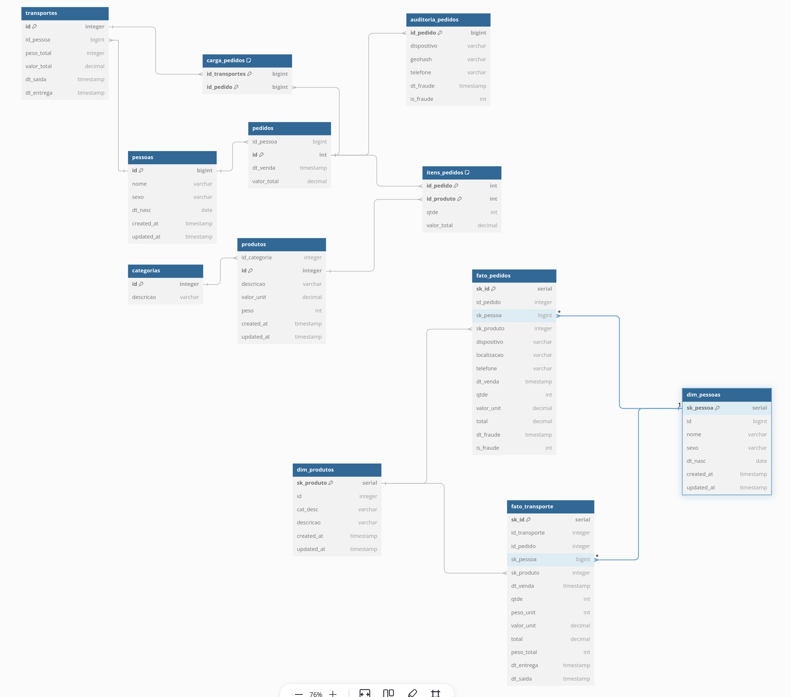

# Data Modeling

Bem-vindo ao Mapa do Engenheiro de Dados, módulo Data Modeling! Este programa prático e desafiador recria situações reais enfrentadas por profissionais da área de dados. Aqui, você aprenderá a construir modelos transacionais e dimensionais, além de desenvolver fluxos de ETL para movimentar dados entre esses dois mundos.

Ao final do curso, você terá domínio de conceitos avançados de modelagem de dados e SQL, sendo capaz de criar soluções que simulam o dia a dia de grandes arquiteturas de dados.

---

## Objetivos do Módulo

- Colocar em prática a modelagem transacional (3FN) e dimensional (Star Schema).
- Desenvolver fluxos de ETL sem o uso de ferramentas automatizadas, utilizando SQL puro.
- Simular a movimentação de dados em ambientes de **Data Warehousing**.
- Criar consultas transacionais e analíticas com foco em performance e confiabilidade.

---

## Demanda

### Identificação Fraude

Como a modelagem atual não trás nenhuma informação que ajude a identificar as fraudes, a diretoria pensou em algumas possibilidades, enquanto o time busca por mais detalhes. 

 - Clientes agindo de má-fé
 - Fraude real
 - Fraude na entrega do pedido

Alguns clientes reportaram fraude em seus pedidos, muitos alegaram que o dispositivo ou a região não batem com o perfil de compra deles. Além disso precisamos acompanhar a logística de entrega dos pedidos. A fraude foi o start inicial para algumas mudanças não planejadas, e com isso foi feito uma analise de requisitos que nós deu algumas direções.

1. **Clientes - Pedidos analíticos**: 
 - Fraude confirmadas: Compras fora do estado de MG, RJ e SP
 - Fraude confirmadas: Compras por dispositivo difernete de Samsung e Iphone.
 - Marcar na tabela pedido um novo campo de fraude e dt_fraude.
 - Levar essa mudança para o ETL

2. **Logístico - Pedido Operacional**: 
 - Precisamos registrar o caminhão, que vai fazer o pedido. Onde um caminhão pode levar vários pedidos.
 - Já pensar em levar para modelagem dimensional

### Redução de custos logístico

Empresa quer reduzir custos e vimos uma oportunidade na logística. Pagamos o transporte por peso, e queremos negociar um valor justo com a transportadora. Precisamos pegar o histórico médio diário do peso dos pedidos.

### Solução
Caso queria seguir nosso passo a passo iremos fazer as alterações conforme imagem

